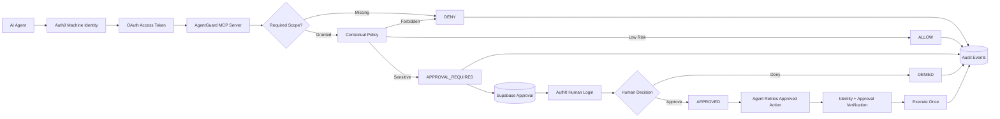

# AgentGuard MCP

Identity-aware authorization for AI agents.

AgentGuard MCP is a protected Model Context Protocol server that gives AI agents distinct machine identities, enforces least-privilege OAuth permissions, applies contextual authorization policy, and pauses sensitive actions for authenticated human approval before execution.

It is the authorization backend for [AgentGuard](https://github.com/haisamar/agentguard).

**Live product:** https://agentguard-eight.vercel.app

---

## Why AgentGuard?

Giving an AI agent access to a tool is easy.

Controlling **which agent can use which tool, under what conditions, and when a human must intervene** is harder.

AgentGuard separates those concerns:

- **Auth0** authenticates machine and human identities.
- **OAuth scopes** define what each machine identity is allowed to request.
- **AgentGuard policy** evaluates the context of the action.
- **Human approval** gates higher-risk operations.
- **Supabase** persists approval state and security audit events.
- **MCP** exposes the protected tools to AI runtimes.

An agent can therefore be authenticated without automatically being trusted to perform every action.

---

## Architecture



---

## Security Model

AgentGuard uses two distinct identity classes.

### Machine identities

Each autonomous runtime receives a separate Auth0 Machine-to-Machine identity.

Example demo identities:

| Runtime | Purpose | Granted scopes |
|---|---|---|
| Sales Agent | Revenue operations | `crm:read`, `crm:write`, `support:read` |
| Finance Agent | Finance operations | `crm:read`, `finance:read`, `finance:refund` |
| Admin Runtime | Administrative automation | `agent:manage` |

A Sales Agent cannot issue refunds simply because another agent can.

The authorization layer checks the scopes carried by the caller's OAuth access token before the protected tool is executed.

### Human identities

Human operators authenticate separately through an Auth0 Regular Web Application in the AgentGuard dashboard.

Machine identities and human identities are intentionally separated.

A sensitive request may therefore look like:

```text
Finance Agent
    ↓
Authenticated machine identity
    ↓
finance:refund scope
    ↓
Contextual policy
    ↓
APPROVAL_REQUIRED
    ↓
Authenticated human administrator
    ↓
APPROVED
    ↓
Finance Agent executes approved action
```

---

## Authorization Layers

AgentGuard applies authorization in layers.

### 1. Authentication

The MCP server validates the Auth0 access token and establishes the caller's identity.

### 2. OAuth scope authorization

Protected tools declare the scopes required to call them.

Example:

```python
@require_scopes(["finance:refund"])
```

If the caller does not have the required scope, execution stops immediately.

### 3. Contextual policy

Passing the OAuth check does not automatically authorize execution.

AgentGuard evaluates the context of the requested action.

Current demo rules include:

```text
Refund <= $500
→ ALLOW

Refund > $500
→ APPROVAL_REQUIRED

Customer data export
→ APPROVAL_REQUIRED

Customer deletion
→ DENY
```

### 4. Human approval

Sensitive operations are written to the approval store and paused.

A separately authenticated human can approve or deny the request through the AgentGuard dashboard.

### 5. Approval-bound execution

An approved action can only be executed by the machine identity that originally requested it.

AgentGuard checks:

- approval exists
- approval status is `APPROVED`
- approval belongs to the requesting identity
- approval action matches the requested tool
- approval has not already been executed

### 6. Replay protection

After successful execution:

```text
APPROVED
→ EXECUTED
```

A second execution attempt is denied and recorded as a security event.

---

## Demonstrated Security Cases

The project includes three persisted scenarios that are also visible in the public AgentGuard demo.

### Human approved

```text
Finance Agent
→ finance:refund scope verified
→ requests $750 refund
→ policy requires approval
→ human administrator approves
→ Finance Agent executes
→ ALLOW
→ approval becomes EXECUTED
```

### Human denied

```text
Finance Agent
→ finance:refund scope verified
→ requests $750 refund
→ policy requires approval
→ human administrator denies
→ Finance Agent attempts execution
→ DENY
```

### Scope blocked

```text
Sales Agent
→ attempts issue_refund
→ missing finance:refund
→ DENY

Contextual policy is never evaluated.
Human review is never reached.
```

This demonstrates the difference between:

- authentication
- authorization
- contextual policy
- human control

---

## MCP Tools

The current demo exposes five protected MCP tools.

### `search_accounts`

Search CRM accounts.

Required scope:

```text
crm:read
```

### `issue_refund`

Request or execute a refund depending on policy.

Required scope:

```text
finance:refund
```

Policy:

```text
amount <= $500 → ALLOW
amount > $500  → APPROVAL_REQUIRED
```

### `list_pending_approvals`

Lists approval requests waiting for review.

Required scope:

```text
agent:manage
```

### `approve_action`

Administrative MCP approval path used during machine-runtime testing.

Required scope:

```text
agent:manage
```

The portfolio application also supports a preferred human approval path through the Auth0-protected Next.js dashboard.

### `execute_approved_refund`

Executes an already-approved refund.

Required scope:

```text
finance:refund
```

The server verifies the approval belongs to the calling machine identity before execution.

---

## Approval Lifecycle

Approval records use four states:

```text
PENDING
APPROVED
DENIED
EXECUTED
```

Typical successful lifecycle:

```text
PENDING
   ↓
APPROVED
   ↓
EXECUTED
```

Denied lifecycle:

```text
PENDING
   ↓
DENIED
```

Review and approval are stored separately.

This allows AgentGuard to represent:

```text
DENIED
reviewed_by = Human Administrator
approved_by = null
```

without incorrectly treating a human denial as an approval.

---

## Audit Events

AgentGuard records authorization and policy decisions in Supabase.

Example events include:

```text
ALLOW
DENY
APPROVAL_REQUIRED
APPROVED
```

Security metadata can include:

- granted scopes
- missing scopes
- authorization failures
- approval IDs
- requesting identity
- action context
- replay attempts
- human reviewer
- account/resource identifiers

Example scope failure:

```json
{
  "action": "issue_refund",
  "decision": "DENY",
  "required_scope": "finance:refund",
  "reason": "Missing required scopes: ['finance:refund']",
  "metadata": {
    "granted_scopes": [
      "crm:read",
      "crm:write",
      "support:read"
    ],
    "missing_scopes": [
      "finance:refund"
    ],
    "security_event": "authorization_failure"
  }
}
```

Secrets and access tokens should never be written to the audit log.

---

## Repository Structure

```text
agentguard-mcp/
│
├── database/
│   └── schema.sql
│
├── src/
│   ├── auth0/
│   │   ├── __init__.py
│   │   ├── authz.py
│   │   ├── errors.py
│   │   └── middleware.py
│   │
│   ├── approvals.py
│   ├── audit.py
│   ├── config.py
│   ├── database.py
│   ├── policy.py
│   ├── server.py
│   ├── tools.py
│   └── __init__.py
│
├── .env.example
├── .gitignore
├── pyproject.toml
└── README.md
```

---

## Database

AgentGuard currently uses Supabase/Postgres for:

### `approvals`

Stores sensitive requests and their review lifecycle.

Important fields include:

```text
requesting_identity
action
payload
reason
status

reviewed_by
reviewed_at

approved_by
approved_at

executed_at
```

### `audit_events`

Stores security decisions and execution context.

Important fields include:

```text
identity
action
decision
required_scope
reason
approval_id
metadata
created_at
```

Row Level Security is enabled on both tables.

No public browser policies are created.

Trusted AgentGuard server components access the database using server-only credentials.

See:

```text
database/schema.sql
```

---

## Local Setup

### Requirements

- Python 3.10+
- Auth0 tenant
- Supabase project
- Auth0 Machine-to-Machine applications
- Auth0 API configured for the MCP resource

### Clone

```bash
git clone https://github.com/haisamar/agentguard-mcp.git
cd agentguard-mcp
```

### Create a virtual environment

Windows:

```powershell
python -m venv .venv
.\.venv\Scripts\Activate.ps1
```

macOS/Linux:

```bash
python -m venv .venv
source .venv/bin/activate
```

### Install dependencies

Using Poetry:

```bash
pip install poetry
poetry install
```

Or install the required dependencies manually if preferred.

### Configure environment

Copy:

```text
.env.example
```

to:

```text
.env
```

and configure your own credentials.

Never commit `.env`.

---

## Required Environment Variables

```env
AUTH0_DOMAIN=
AUTH0_AUDIENCE=http://localhost:3001/
MCP_SERVER_URL=http://localhost:3001/
PORT=3001

SALES_AGENT_CLIENT_ID=
SALES_AGENT_CLIENT_SECRET=

FINANCE_AGENT_CLIENT_ID=
FINANCE_AGENT_CLIENT_SECRET=

ADMIN_AGENT_CLIENT_ID=
ADMIN_AGENT_CLIENT_SECRET=

SUPABASE_URL=
SUPABASE_SECRET_KEY=
```

---

## Auth0 API Permissions

The AgentGuard API currently defines permissions including:

```text
crm:read
crm:write

support:read
support:write

finance:read
finance:refund

customer:export

agent:manage
```

Machine-to-Machine applications should receive only the permissions needed for their role.

---

## Run the MCP Server

From the repository root:

```bash
python -m src.server
```

Default server:

```text
http://localhost:3001/
```

MCP endpoint:

```text
http://localhost:3001/mcp
```

Protected-resource metadata:

```text
http://localhost:3001/.well-known/oauth-protected-resource
```

---

## Testing With MCP Inspector

Start the MCP Inspector:

```bash
npx -y @modelcontextprotocol/inspector
```

Connect using:

```text
Transport:
Streamable HTTP

URL:
http://localhost:3001/mcp
```

Use an Auth0 Machine-to-Machine access token in the authorization header:

```text
Authorization: Bearer <ACCESS_TOKEN>
```

Do not commit or expose access tokens.

---

## Frontend

The companion AgentGuard product interface is available here:

**Repository**

https://github.com/haisamar/agentguard

**Live demo**

https://agentguard-eight.vercel.app

It provides:

- public product page
- sanitized public security demo
- Auth0-protected administrator dashboard
- human approve/deny controls
- machine vs human identity visualization
- authorization trace explorer
- interactive security-event inspection
- approval history

---

## Technology

AgentGuard combines:

```text
Auth0
OAuth 2.0
Model Context Protocol
Python
FastMCP
Starlette
Supabase / PostgreSQL
Next.js
Human-in-the-loop authorization
```

---

## Design Principle

AgentGuard is based on a simple idea:

> An AI agent being authenticated should not mean it has unlimited authority.

Authentication proves **who the agent is**.

OAuth scopes determine **what category of actions it may request**.

Contextual policy determines **whether that specific action can execute autonomously**.

Human approval provides a separate identity boundary for high-risk decisions.

---

## Current Scope

AgentGuard is a portfolio security prototype rather than a production IAM platform.

Current limitations intentionally include:

- demo policy rules are defined in code
- machine identities are mapped to demo roles
- the MCP backend is designed for controlled/local deployment
- human admin authorization currently uses an application-level administrator allowlist
- policy management is not yet exposed through a control plane
- audit-event immutability is not enforced at the database layer
- distributed locking for concurrent execution is outside the current demo scope

These boundaries are intentionally documented rather than hidden.

---

## Possible Extensions

Future versions could add:

- Auth0 role-based human administration
- policy-as-code
- policy versioning
- agent identity registry
- workload identity federation
- delegated authorization
- time-limited approvals
- resource-level authorization
- approval expiration
- organization-level isolation
- signed audit events
- SIEM export
- policy simulation
- production MCP deployment
- additional MCP tools and resource servers

---

## Related Project

AgentGuard frontend:

https://github.com/haisamar/agentguard