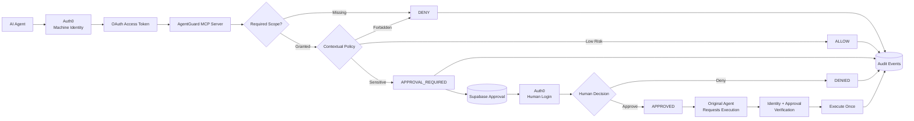

# AgentGuard MCP

[](https://m8ven.ai/mcp/haisamar-agentguard-mcp-mpew3p)

### Identity-Aware Authorization for AI Agents

AgentGuard MCP is the protected Model Context Protocol authorization backend for AgentGuard.

It gives AI runtimes distinct machine identities, enforces least-privilege OAuth permissions, evaluates contextual security policy, pauses high-risk actions for authenticated human approval, binds approvals back to the requesting identity, prevents approval replay, and records security decisions in Supabase.

**Frontend Repository:**  
https://github.com/haisamar/agentguard

**Live Product:**  
https://agentguard-eight.vercel.app

**Public Demo:**  
https://agentguard-eight.vercel.app/demo

---

# Why AgentGuard MCP?

Giving an AI agent access to a tool is easy.

Controlling:

> which agent can use which tool, under what conditions, and when a human must intervene

is harder.

AgentGuard separates that problem into distinct security layers.

- **Auth0** establishes machine and human identities.
- **OAuth scopes** define which classes of operations each machine identity may request.
- **AgentGuard policy** evaluates the context of the specific action.
- **Human approval** creates a separate authority boundary for sensitive operations.
- **Approval-bound execution** ensures approval can only be used by the original requesting identity.
- **Replay protection** prevents an executed approval from being reused.
- **Supabase** persists approval state and audit events.
- **MCP** exposes protected tools to agent runtimes.

The design principle is:

> An AI agent being authenticated should not mean it has unlimited authority.

---

# Architecture



---

# Security Model

AgentGuard uses distinct machine and human security principals.

---

## Machine Identities

Each autonomous runtime receives a separate Auth0 Machine-to-Machine identity.

Example roles:

| Runtime | Purpose | Granted Scopes |
|---|---|---|
| Sales Agent | Revenue Operations | `crm:read`, `crm:write`, `support:read` |
| Finance Agent | Finance Operations | `crm:read`, `finance:read`, `finance:refund` |
| Admin Runtime | Security Administration | `agent:manage` |

This means a Sales Agent cannot issue refunds simply because another agent can.

The caller's OAuth access token determines which permissions belong to that identity.

---

## Human Identities

Human administrators authenticate separately through an Auth0 Regular Web Application.

Machine identity and human identity are intentionally separate.

Example:

```text
Finance Agent
   ↓
Authenticated Machine Identity
   ↓
finance:refund
   ↓
Contextual Policy
   ↓
APPROVAL_REQUIRED
   ↓
Human Administrator
   ↓
Authenticated Human Identity
   ↓
APPROVED
   ↓
Original Finance Agent Executes
```

This creates a separation of duties between:

```text
request authority
```

and:

```text
approval authority
```

---

# Authorization Layers

AgentGuard applies multiple authorization layers before sensitive execution occurs.

---

## 1. Authentication

The MCP server validates the Auth0 access token and establishes the caller identity.

Authentication answers:

```text
Who is this runtime?
```

It does not automatically answer:

```text
What is this runtime allowed to do?
```

---

## 2. OAuth Scope Authorization

Protected MCP tools declare which OAuth permissions are required.

Example:

```python
@require_scopes(["finance:refund"])
```

If the caller does not possess:

```text
finance:refund
```

the action is denied immediately.

Example:

```text
Sales Agent
   ↓
Authenticated
   ↓
issue_refund
   ↓
Missing finance:refund
   ↓
DENY
```

Contextual policy is not evaluated.

Human review is not reached.

---

## 3. Contextual Policy

Passing the OAuth scope boundary does not guarantee autonomous execution.

AgentGuard evaluates the specific context of the requested action.

Current demonstration rules include:

```text
Refund <= $500
→ ALLOW

Refund > $500
→ APPROVAL_REQUIRED

Customer data export
→ APPROVAL_REQUIRED

Customer deletion
→ DENY
```

This allows AgentGuard to distinguish:

```text
Can this identity request refunds?
```

from:

```text
Should this particular refund execute autonomously?
```

---

## 4. Human Approval

Sensitive operations are persisted in the approval store.

The operation pauses with:

```text
APPROVAL_REQUIRED
```

A separately authenticated human can then approve or deny the request through the AgentGuard dashboard.

---

## 5. Approval-Bound Execution

An approved action may only be executed by the machine identity that originally requested it.

Before execution, AgentGuard verifies:

```text
approval exists
```

```text
status == APPROVED
```

```text
requesting identity matches current identity
```

```text
approval action matches requested action
```

```text
approval has not already executed
```

Only after those checks can the protected action continue.

---

## 6. Replay Protection

After successful execution:

```text
APPROVED
   ↓
EXECUTED
```

A second execution attempt is denied.

This prevents the same approval from authorizing the same protected action multiple times.

---

# MCP Tools

The AgentGuard prototype exposes five protected MCP tools.

---

## `search_accounts`

Search CRM account data.

Required permission:

```text
crm:read
```

Example:

```text
Sales Agent
crm:read
   ↓
search_accounts
   ↓
ALLOW
```

---

## `issue_refund`

Request a refund.

Required permission:

```text
finance:refund
```

Policy:

```text
amount <= $500
→ ALLOW

amount > $500
→ APPROVAL_REQUIRED
```

Example low-risk request:

```text
Finance Agent
finance:refund
   ↓
issue_refund($100)
   ↓
ALLOW
```

Example sensitive request:

```text
Finance Agent
finance:refund
   ↓
issue_refund($750)
   ↓
APPROVAL_REQUIRED
```

Example scope failure:

```text
Sales Agent
no finance:refund
   ↓
issue_refund($750)
   ↓
DENY
```

---

## `list_pending_approvals`

Lists approval requests waiting for review.

Required permission:

```text
agent:manage
```

---

## `approve_action`

Administrative MCP approval path used during machine-runtime testing.

Required permission:

```text
agent:manage
```

The portfolio application also contains a preferred human approval workflow through the separately authenticated Next.js administrator dashboard.

---

## `execute_approved_refund`

Executes an already approved refund.

Required permission:

```text
finance:refund
```

AgentGuard verifies that the approval belongs to the current machine identity before allowing execution.

---

# Approval Lifecycle

Approval records use four states:

```text
PENDING
APPROVED
DENIED
EXECUTED
```

Successful flow:

```text
PENDING
   ↓
APPROVED
   ↓
EXECUTED
```

Denied flow:

```text
PENDING
   ↓
DENIED
```

Review information and approval information are represented separately.

This allows a denied request to correctly represent:

```text
status       = DENIED
reviewed_by  = Human Administrator
approved_by  = null
```

without incorrectly treating the reviewer as an approver.

---

# Demo Simulator

The repository includes:

```text
src/demo_simulator.py
```

The simulator creates deterministic security records for the protected AgentGuard administrator dashboard.

It is separate from the public browser simulation.

---

## Scenario 1 — OAuth Scope Denial

```text
Sales Agent
   ↓
Attempts $750 refund
   ↓
Missing finance:refund
   ↓
DENY
```

The generated event includes authorization-failure metadata.

---

## Scenario 2 — Autonomous Allow

```text
Finance Agent
   ↓
Requests $100 refund
   ↓
finance:refund granted
   ↓
Policy satisfied
   ↓
ALLOW
```

---

## Scenario 3 — Approval Required

```text
Finance Agent
   ↓
Requests $750 refund
   ↓
finance:refund granted
   ↓
Refund > $500
   ↓
APPROVAL_REQUIRED
```

---

## Scenario 4 — Human Approved Execution

```text
Human Administrator
   ↓
Approves Request
   ↓
APPROVED
```

The original Finance Agent then executes:

```text
Finance Agent
   ↓
execute_approved_refund
   ↓
Approval verified
   ↓
ALLOW
   ↓
EXECUTED
```

---

## Scenario 5 — Pending Review

The simulator also creates a `$900` refund request and intentionally leaves it pending.

```text
Finance Agent
   ↓
$900 refund
   ↓
APPROVAL_REQUIRED
   ↓
PENDING
```

This gives the administrator dashboard an active request that can be reviewed interactively.

---

## Run the Simulator

Activate the virtual environment:

```powershell
.\.venv\Scripts\Activate.ps1
```

Then:

```powershell
python -m src.demo_simulator
```

---

# Audit Events

AgentGuard records security decisions in Supabase.

Important event decisions include:

```text
ALLOW
DENY
APPROVAL_REQUIRED
APPROVED
```

Audit metadata may include:

- granted scopes
- missing scopes
- authorization failures
- approval IDs
- requesting identity
- action context
- human reviewer
- resource identifiers
- replay attempts

Example authorization failure:

```json
{
  "action": "issue_refund",
  "decision": "DENY",
  "required_scope": "finance:refund",
  "reason": "Missing required OAuth scope: finance:refund",
  "metadata": {
    "granted_scopes": [
      "crm:read",
      "crm:write",
      "support:read"
    ],
    "missing_scopes": [
      "finance:refund"
    ],
    "security_event": "authorization_failure"
  }
}
```

OAuth access tokens, client secrets, and credentials should never be written into the audit log.

---

# Database

AgentGuard uses Supabase/PostgreSQL.

The two primary tables are:

```text
approvals
audit_events
```

---

## `approvals`

Stores sensitive operations and their review lifecycle.

Important fields include:

```text
id
requesting_identity
action
payload
reason
status

reviewed_by
reviewed_at

approved_by
approved_at

created_at
executed_at
```

---

## `audit_events`

Stores security decisions and execution context.

Important fields include:

```text
id
identity
action
decision
required_scope
reason
approval_id
metadata
created_at
```

Row Level Security is enabled.

No public browser policies are intentionally created for sensitive AgentGuard records.

Trusted server-side components use protected server credentials.

---

# Repository Structure

```text
agentguard-mcp/
│
├── database/
│   └── schema.sql
│
├── src/
│   │
│   ├── auth0/
│   │   ├── __init__.py
│   │   ├── authz.py
│   │   ├── errors.py
│   │   └── middleware.py
│   │
│   ├── approvals.py
│   ├── audit.py
│   ├── config.py
│   ├── database.py
│   ├── demo_simulator.py
│   ├── policy.py
│   ├── server.py
│   ├── tools.py
│   └── __init__.py
│
├── .env.example
├── .gitignore
├── pyproject.toml
└── README.md
```

---

# Environment Configuration

AgentGuard MCP reads environment variables from `.env`.

Example:

```env
AUTH0_DOMAIN=
AUTH0_AUDIENCE=http://localhost:3001/

MCP_SERVER_URL=http://localhost:3001/
PORT=3001

SALES_AGENT_CLIENT_ID=
SALES_AGENT_CLIENT_SECRET=

FINANCE_AGENT_CLIENT_ID=
FINANCE_AGENT_CLIENT_SECRET=

ADMIN_AGENT_CLIENT_ID=
ADMIN_AGENT_CLIENT_SECRET=

SUPABASE_URL=
SUPABASE_SECRET_KEY=
```

Never commit `.env`.

---

# Auth0 API Permissions

The AgentGuard Auth0 API defines permissions including:

```text
crm:read
crm:write

support:read
support:write

finance:read
finance:refund

customer:export

agent:manage
```

Each Machine-to-Machine application should receive only the permissions needed for its role.

---

# Local Setup

## Requirements

- Python 3.10+
- Auth0 tenant
- Auth0 Machine-to-Machine applications
- Auth0 API configured for AgentGuard
- Supabase project

Clone:

```bash
git clone https://github.com/haisamar/agentguard-mcp.git
cd agentguard-mcp
```

---

## Create Virtual Environment

### Windows PowerShell

```powershell
python -m venv .venv
.\.venv\Scripts\Activate.ps1
```

### macOS / Linux

```bash
python -m venv .venv
source .venv/bin/activate
```

---

## Install Dependencies

Using Poetry:

```bash
pip install poetry
poetry install
```

Configure:

```text
.env
```

using:

```text
.env.example
```

as the template.

---

# Run the MCP Server

From the repository root:

```powershell
.\.venv\Scripts\Activate.ps1
python -m src.server
```

Default server:

```text
http://localhost:3001
```

MCP endpoint:

```text
http://localhost:3001/mcp
```

OAuth protected-resource metadata:

```text
http://localhost:3001/.well-known/oauth-protected-resource
```

Keep this terminal running while testing the MCP backend.

---

# Auth0 OAuth Metadata

AgentGuard publishes protected-resource metadata for the MCP resource.

The server integrates with the configured Auth0 issuer and audience.

Machine clients obtain OAuth access tokens from Auth0 and send them to AgentGuard MCP as bearer tokens.

The authorization middleware validates the identity and exposes the granted scopes to protected MCP tools.

---

# MCP Inspector Note

Some MCP Inspector OAuth workflows attempt Dynamic Client Registration.

The Auth0 tenant used for this prototype does not enable Dynamic Client Registration.

Because of that, the Inspector's automatic registration workflow is not the primary validation path for this project.

The MCP server itself still exposes OAuth protected-resource metadata and validates Auth0 access tokens.

AgentGuard's recruiter-facing demonstration is provided through:

```text
Public deterministic simulation
+
Protected administrator console
+
Real MCP authorization implementation
```

---

# Frontend

The companion AgentGuard frontend is:

https://github.com/haisamar/agentguard

Live product:

https://agentguard-eight.vercel.app

Public demo:

https://agentguard-eight.vercel.app/demo

The frontend provides:

- public product experience
- deterministic security simulation
- technical trace explorer
- Auth0-protected administrator console
- machine identity inventory
- human operator identity
- approval controls
- persisted authorization trace explorer
- security activity feed
- audit-event inspection
- approval history

---

# Public Demo vs Backend Records

These are intentionally different systems.

## Public Demo

```text
Deterministic
Client-side
Read-only
No sensitive identifiers
No Supabase security records exposed
```

## Protected Administrator Dashboard

```text
Persisted Supabase approvals
Persisted audit events
Real administrator authentication
Human approve / deny controls
Sensitive identity context
```

This separation makes the project publicly reviewable without exposing privileged security data.

---

# Security Principles Demonstrated

### Authentication ≠ Authorization

An authenticated machine can still be denied.

### Least Privilege

Every runtime receives only the OAuth scopes needed for its role.

### Contextual Authorization

A valid permission does not always mean immediate execution.

### Separation of Duties

Machines request sensitive actions while humans independently approve them.

### Human-in-the-Loop Authorization

Autonomous authority stops at defined policy thresholds.

### Approval-Bound Execution

Approval belongs to a specific requesting identity and action.

### Replay Protection

An executed approval cannot be reused.

### Auditability

Security decisions are persisted with identity and authorization context.

---

# Design Principle

AgentGuard is based on one core idea:

> An AI agent being authenticated should not mean it has unlimited authority.

Authentication proves:

```text
who the agent is
```

OAuth scopes determine:

```text
what category of operations it may request
```

Contextual policy determines:

```text
whether that exact operation should execute autonomously
```

Human approval creates:

```text
a separate authority boundary for sensitive decisions
```

---

# Current Scope

AgentGuard MCP is a security portfolio prototype rather than a production IAM platform.

Intentional boundaries currently include:

- demonstration policies are defined in application code
- machine identities are mapped to demonstration roles
- human administrator authorization uses an application-level allowlist
- policy management is not exposed through a dedicated control plane
- audit events are not cryptographically immutable
- distributed locking for production concurrency is outside the prototype scope
- approval expiration is not implemented
- backend deployment is designed primarily for controlled testing

These limitations are documented rather than hidden.

---

# Possible Extensions

Future versions could add:

- Auth0 role-based administrator access
- policy-as-code
- policy versioning
- centralized agent identity registry
- workload identity federation
- delegated authorization
- resource-level authorization
- approval expiration
- time-limited privileges
- organization isolation
- step-up authentication
- signed audit records
- SIEM export
- policy simulation
- dynamic risk scoring
- additional MCP tools
- production MCP deployment
- distributed execution locking

---

# Project Motivation

AgentGuard explores a question:

> What does identity security look like when the user is not always a human?

Autonomous AI runtimes can increasingly:

```text
call APIs
use tools
change records
trigger workflows
take financial actions
```

That makes identity and authorization critical at the agent layer.

AgentGuard applies familiar IAM concepts such as:

```text
machine identity
OAuth scopes
least privilege
separation of duties
human approval
auditability
```

to autonomous agent execution.

---

# Related Project

## AgentGuard Frontend

https://github.com/haisamar/agentguard

## Live Product

https://agentguard-eight.vercel.app

## Interactive Demo

https://agentguard-eight.vercel.app/demo
